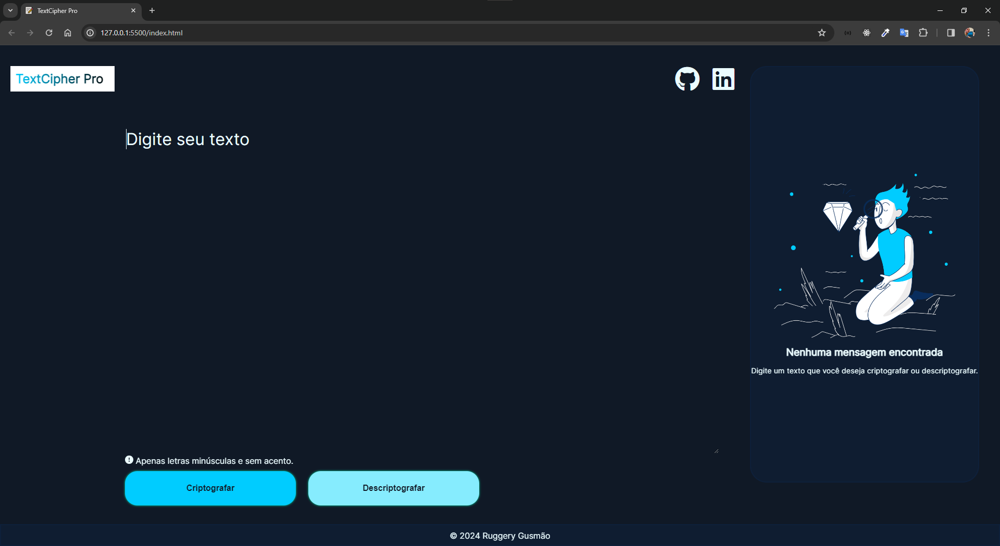
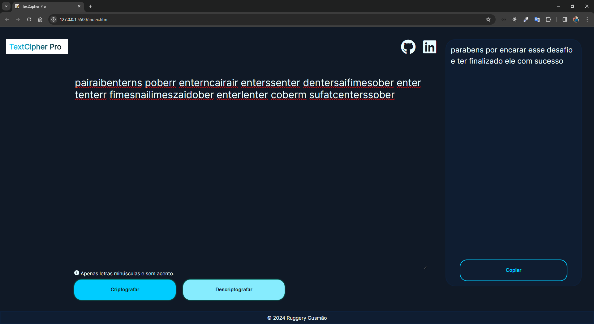
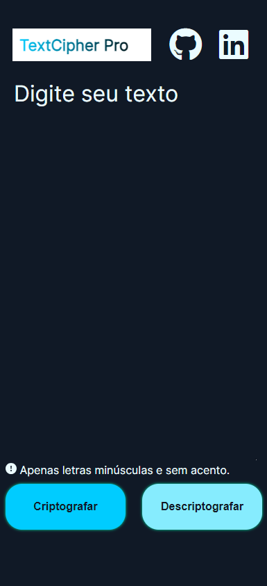
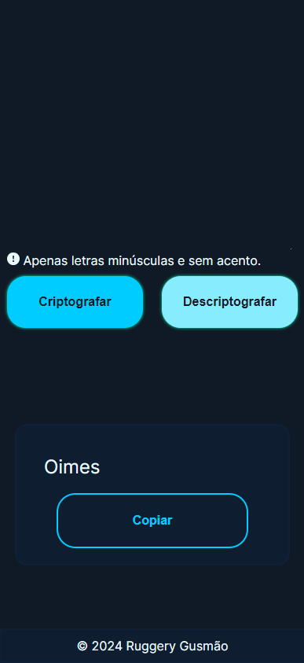

## 🔑 Desafio Decodificador de Texto

Projeto do Alura Challenge Oracle One #challengeonedecodificador5

## 📄  Sobre o desafio
Boas vindas ao primeiro desafio!

Durante estas duas semanas, vamos trabalhar em uma aplicação que criptografa textos, assim você poderá trocar mensagens secretas com outras pessoas que saibam o segredo da criptografia utilizada.

As "chaves" de criptografia que utilizaremos são:
* A letra "e" é convertida para "enter"
* A letra "i" é convertida para "imes"
* A letra "a" é convertida para "ai"
* A letra "o" é convertida para "ober"
* A letra "u" é convertida para "ufat"

Requisitos:
- Deve funcionar apenas com letras minúsculas
- Não devem ser utilizados letras com acentos nem caracteres especiais
- Deve ser possível converter uma palavra para a versão criptografada e também retornar uma palavra criptografada para a versão original.

Por exemplo:
"gato" => "gaitober"
gaitober" => "gato"

A página deve ter campos para inserção do texto a ser criptografado ou descriptografado, e a pessoa usuária deve poder escolher entre as duas opções
O resultado deve ser exibido na tela.
Extras:
- Um botão que copie o texto criptografado/descriptografado para a área de transferência - ou seja, que tenha a mesma funcionalidade do ctrl+C ou da opção "copiar" do menu dos aplicativos.

## 🚀 Deploy

Github Pages: [link](https://ruggerygusmao.github.io/project-text-decoder/)

## 💻 Desktop 

## 📱 Mobile

### 🛠️ Tecnologias

<code></code>
<code></code>
<code></code>